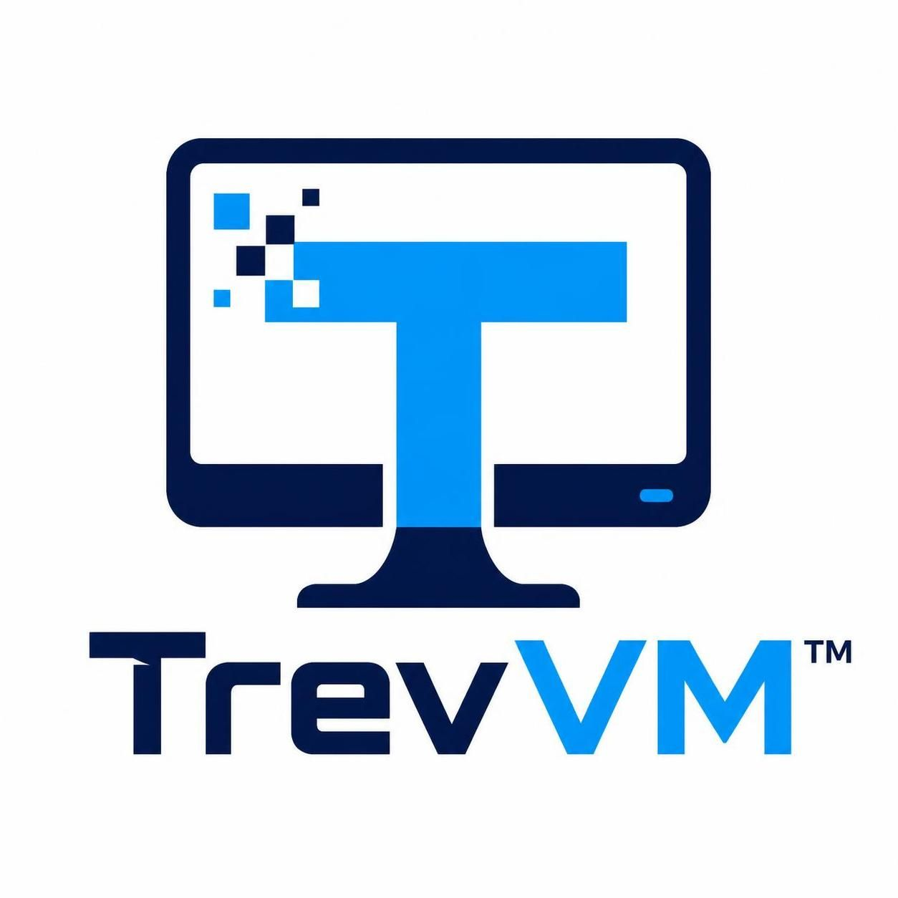
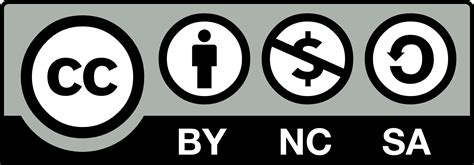

# $\color{#0B1F4B}{\textsf{Trev}}\color{#66C7F2}{\textsf{VM}}$ 🖥 (run this in a deployed environment)
#### PANIC KEY IS EQUAL 

Here at TrevVM we try to make everything simple and easy. This Easy-to-use Linux desktop is great to use for <b>heavily-restricted</b> access to certain things that appear blocked or unavailable. We use pull requests to make sure our code is safe, commit the changes on branches, and it's very up-to-date. 

<b>We also use this to test features that can be added sooner in codespaces.</b>

-----
## Installation 🔑
Make a codespaces by pressing the green code button. Then click Create codespaces on main. When you load the codespace in, type this cmd that is below in the terminal:
```
curl -O https://raw.githubusercontent.com/TrevorTesch/TrevVM/main/install.sh
chmod +x install.sh
./install.sh
```
<b>NOTE: GO TO THE TREVM WIKI FOR INSTALLATION. WIKI SHOWCASES HOW TO INSTALL PROPERLY.</b>
## Q&A 📢
When you successfully run the vm, you can install windows files. You can run .exe (ex. install fortnite, obs to stream, etc). You can ask any more Questions in discussions tab.

## Cool Add-ons 📜

- Enjoy a panic button at your disposal (press equal key to redirect)
- No ads or trackers.
- Real games, the ability to install anything. (ex. any exe that can be ran on windows)
- Hard to block python-feature off 3rd party. (Python and shell scripts rather than html or js that can be detected by school-work blockers.)

## Requirements 🔐
You need to add some requirements installed, type this in the terminal. (sometimes this isnt pre-installed)
```
pip install -r requirements.txt
```
Or these
```
python -m pip install -r requirements.txt
```
Or this
```
python3 -m pip install -r requirements.txt
```

## Wiki 🗳️

#### I'm sure some of y'all can get confused from all the stuff that works here, we will try to explain and have easy access on our page wiki to make things easier. It can make things get clearer for any questions.

> ### NOTE: These files are subject to changes, so if you still have any questions, go to discussions or issues.

## Fork ♾️

Yes, this is based of a repo called <a href="https://github.com/Blobby-Boi/BlobeVM">BlobeVM</a>. But it isn't actively being edited, or maintained anymore. It's most likely a sitting <b>archive</b> almost. This will have all the good features and be active to the public for future code and development. 

As school progress, so as blockers like GoGuardian, or Lightspeed. Those to name a few, are very good at what they do. Luckily the fact that this is very active, new tactics can be patched and fixed.

###### (C) 2026-present <a href="https://github.com/TrevorTesch/TrevVM/">TrevVM</a> and its contributors. Always follow the rules and policies of the repo before making/create anything to/from the repo.


